# final-project-Eric-Zheng29<br>
## Trojan Map<br>
final-project-Eric-Zheng29 created by GitHub Classroom<br>
Team member: Tao Zheng, Team Name: Accepted<br>

---

### Overview<br>
This project focuses on using data structures and graph search algorithms to build a mapping application. The input is a map of USC campus. When you open this program, it will show you a menu, which includes 6 choices:<br>
```shell
**************************************************************
* Select the function you want to execute.
* 1. Autocomplete
* 2. Find the position
* 3. CalculateShortestPath
* 4. Traveling salesman problem(Brute force)
* 5. Traveling salesman problem(2_OPT)
* 6. Exit
**************************************************************
```
When you type a number in the menu, it will go to the function. You need follow the function instruction and it will give you teh reuslt you want. Here is a little demo of how this program works.
<p align="center">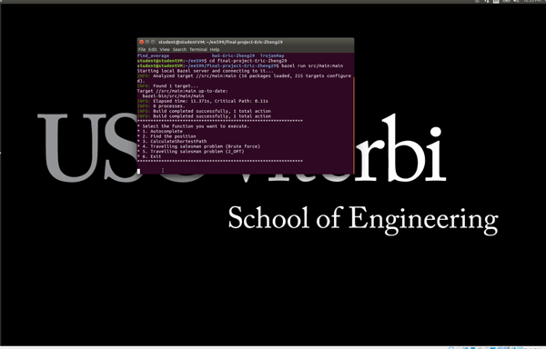</p>

---

### Data Structure
Each point on the map is represented by the class **Node** shown below and defined in [trojanmap.h](src/lib/trojanmap.h).

```cpp
class Node {
  public:
    std::string id; // A unique id assign to each point
    double lat;     // Latitude
    double lon;     // Longitude
    std::string name; // Name of the location. E.g. "Bank of America".
    std::vector<std::string> neighbors; // List of the ids of all neighbor points.
};
```
---

### Function1:Autocomplete
```c++
std::vector<std::string> Autocomplete(std::string name);
```
When you want to run this function, you can type the partial name of the location and it will return a list of possible locations with partial name as prefix. Uppercase and lower case are treated as the same character.<br>
<p align="center">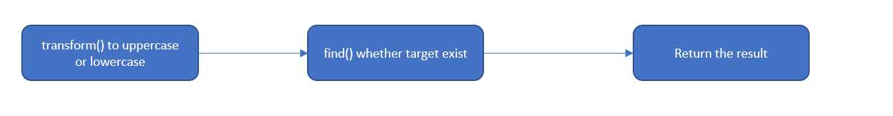</p>

#### Pseudocode
```
Input a string;
transform the input string to upper case or lower case;
iterate all nodes:
  transform node.name as input string;
  if node.name contains input:
    return node.name
```
#### Examples of function1
<p align="center">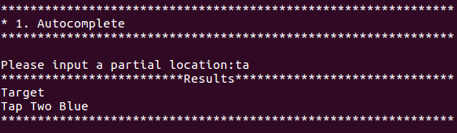</p>
<p align="center">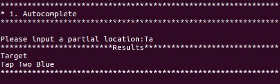</p>
<p align="center">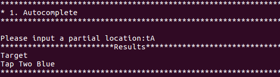</p>
<p align="center">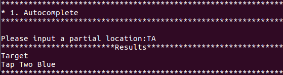</p>

#### Discussion
When I implementation this functiuon first time, I didn't see the claim, "a list of possible locations with partial name as **prefix**", I miss the key word Prefix, so I return the all nodes' name which contain the input string. Finally, I change the find() third parameter from end() to 0, and then it can just return the right results.

---

### Function2: GetPosition
```c++
std::pair<double, double> GetPosition(std::string name);
```
When user inputs a location name which he/she wants to get its position(latitude and longtitude), if this position is in this map, the program will print its position, otherwise print "do not find". What's more, for visulizition, if found, it will be marked as a red point in the map. This input string is case sensitive.<br>
#### Pseudocode
```
for all nodes:
  if node.name = input:
    return node.lat and node.lon
```
#### Examples of function2
<p align="center">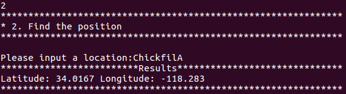</p>
<p align="center"></p>
<p align="center">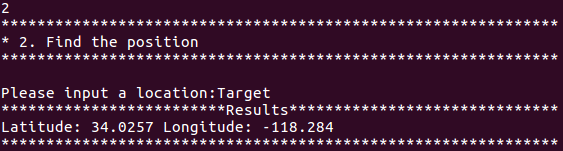</p>
<p align="center">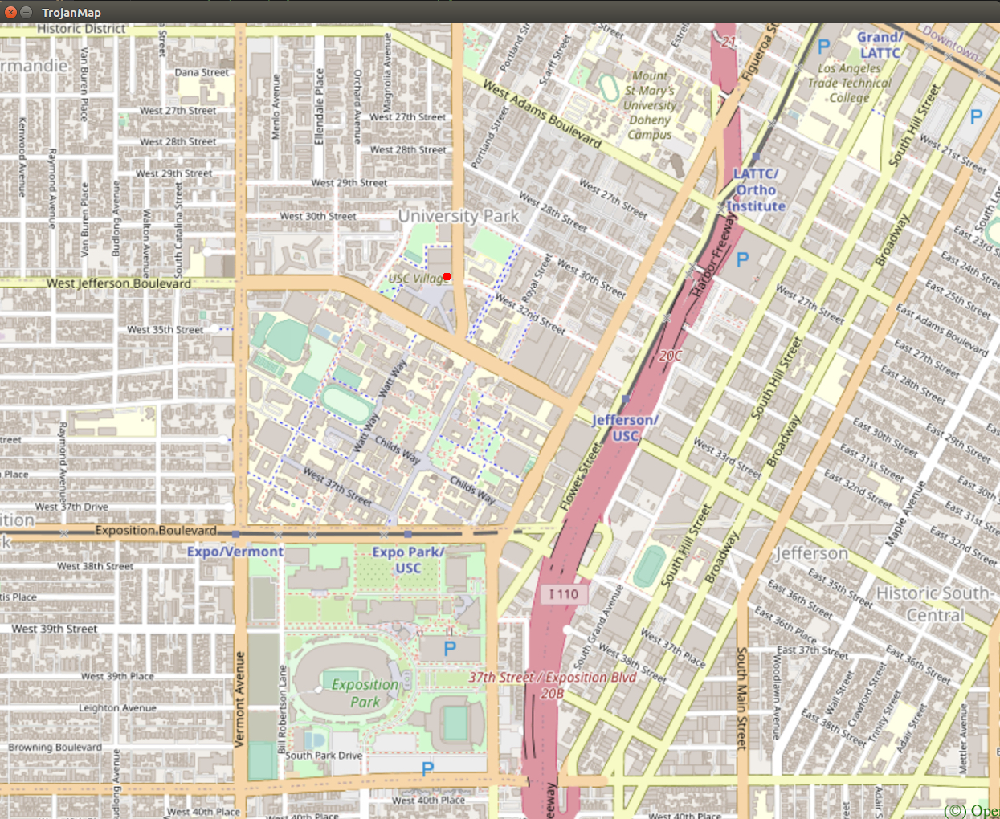</p>

####  Discussion
This function is an easy one.

---

### Function3: CalculateShortestPath---Dijkstra algorithm
```c++
std::vector<std::string> CalculateShortestPath(std::string location1_name,
                                               std::string location2_name);
```
This function wants to find the shortest path between two locations. If found, it will print the shortest path. Otherwise, print "path not found".
#### Pseudocode
```
first find source node's id and target node's id;
create a priority queue to store distance from source node to all other nodes;
Pop the top element of heap, iterate its neighbors, if find a shorter path, update path
Get the shortest path from source to others, just return the one we want
```
#### Examples of function3
<p align="center">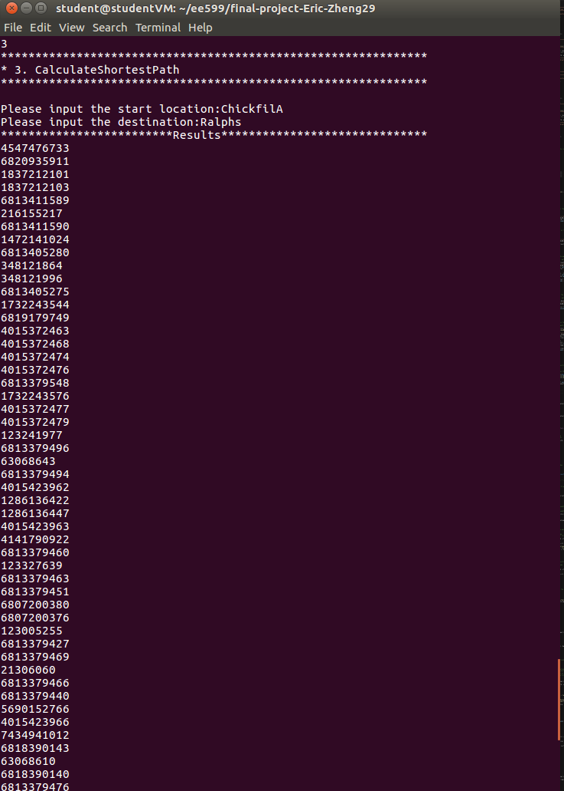</p>
<p align="center">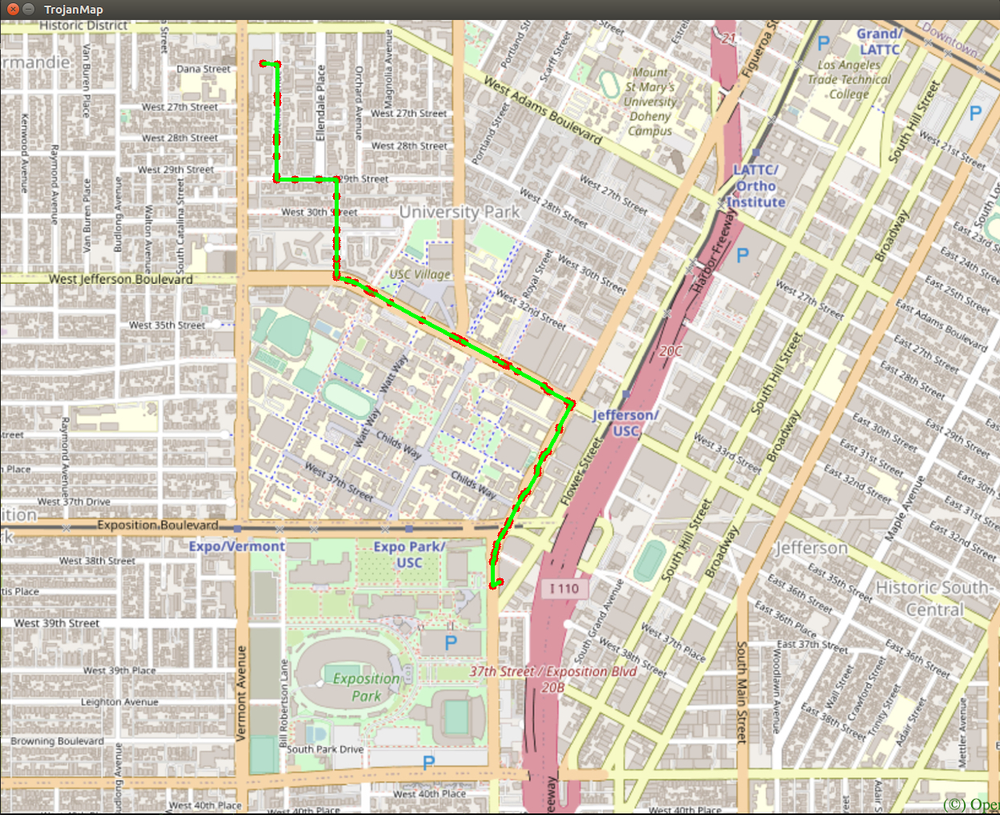</p>
<p align="center">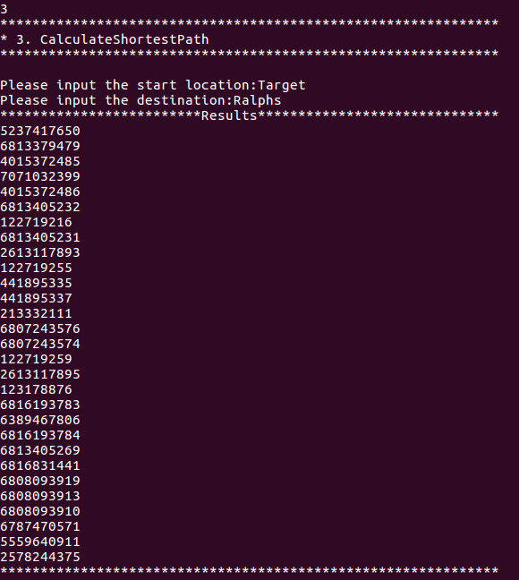</p>
<p align="center">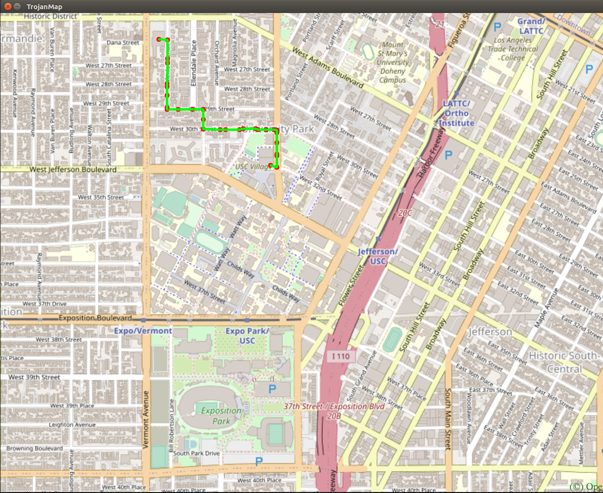</p>

####  Discussion
This problem took me a lot time. I do implement Dijkstra algorithm correctly, but the result was not correct. After debug a lot of times, I found that the inputs were not locations' id but locations' name. When I converted name to ids, the program worked.<br>
Time complexity of Dijkstra algorithm is O(v^2)<br>

---
### Function4: TravelingTrojan---Brute force & 2_OPT algorithm
```c++
std::pair<double, std::vector<std::vector<std::string>>> TravellingTrojan(
      std::vector<std::string> &location_ids);
```
In this section, we assume that a complete graph is given. That means each node is a neighbor of all other nodes.
Given a vector of location ids, assume every location can reach every location in the list (Complete graph. Do not care the neighbors).
Find the shortest route that covers all the locations and goes back to the start point. It will return the progress to get the shortest
route which will be converted to a animation. <br>
Use the following algorithms:

- Brute Force Method
```c++
std::pair<double, std::vector<std::vector<std::string>>> TravellingTrojan(
      std::vector<std::string> &location_ids);
```
- [2-opt Heuristic](https://en.wikipedia.org/wiki/2-opt).
```c++
std::pair<double, std::vector<std::vector<std::string>>> TravellingTrojan_2opt(
      std::vector<std::string> &location_ids);
```
#### Pseudocode
Brute force
```
get all permutations of the input string vector;
calculate each permutation's path distance and return the minimum.
```
2_opt
```
repeat until no improvement is made {
    start_again:
    best_distance = calculateTotalDistance(existing_route)
    for (i = 1; i <= number of nodes eligible to be swapped - 1; i++) {
        for (k = i + 1; k <= number of nodes eligible to be swapped; k++) {
            new_route = 2optSwap(existing_route, i, k)
            new_distance = calculateTotalDistance(new_route)
            if (new_distance < best_distance) {
                existing_route = new_route
                best_distance = new_distance
                goto start_again
            }
        }
    }
}
```
<p align="center">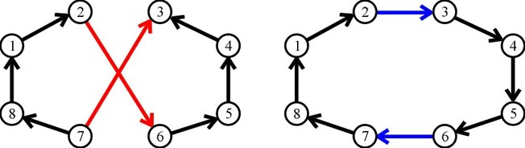</p>
#### Examples of function4
<p align="center">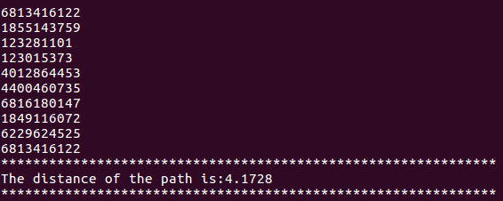</p>
<p align="center"></p>
<p align="center">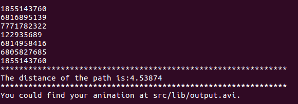</p>
<p align="center">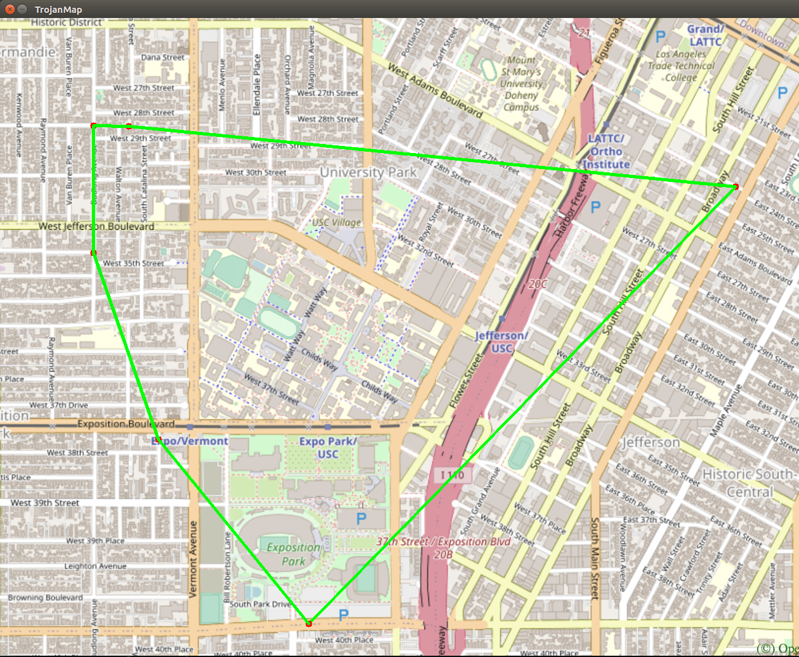</p>
<p align="center"></p>

#### Discussion
2-OPT is heauristic, which may sometimes can not get the global optimization. When write test code, I try to compare the latest path length to the path before update, if the distance reduces, it show my program is working.<br>
Time complexity of brute force is O(n!)<br>
Time complexity of 2-opt is O(n^2)<br>

## Acknowledgement
Many thanks to professor and TAs. They do very well during this semester.I love the homework and project design. In this course, I learned not only basic C++, but also some important algorithms. What's more, coding practice helps me understand program better and do well in my jod interview. Thanks a lot and good luck to all.
